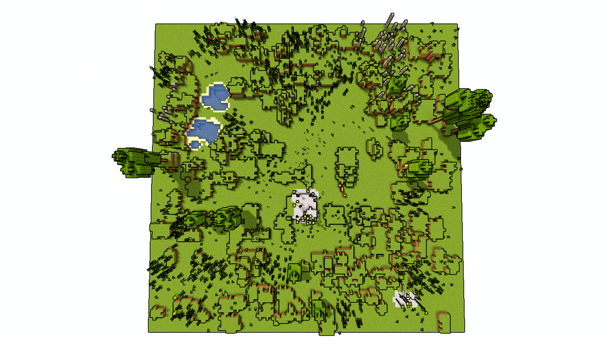

# Ramos Discretos
Caso haja algum bug ou erro, por favor me fale.

Para Windows use INSTALADOR.cmd, para Linux, INSTALADOR.sh
O instalador copiará a pasta para a sua pasta de saves. Caso não funcionem, é possível baixar um arquivo .zip do código, pegar o arquivo do mapa e colocar em sua pasta de saves.

Requisitos:
Minecraft 1.20.1;
Renderização de chunks mínima: 8.

