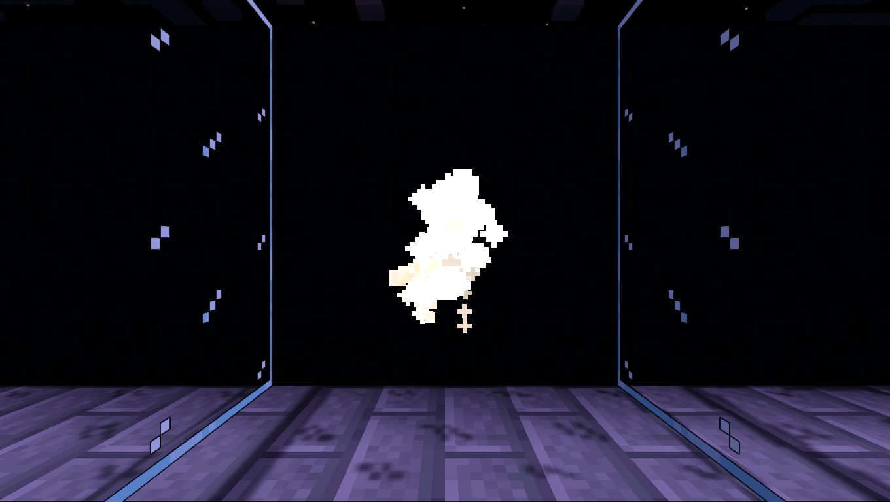
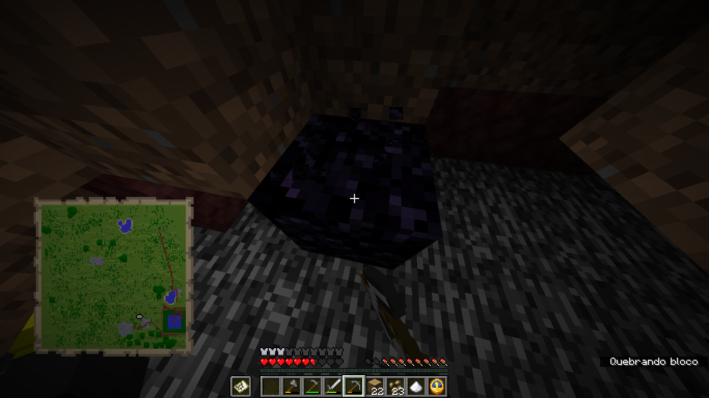

## Início
_Você aparece em uma região com água, árvores, sementes e outros recursos para montar sua plantação, em um período de 10 minutos._
O recomendado é coletar madeiras, sementes através da grama, pedras, abóboras e melancias. Como o cultivo é um processo demorado, as melancias servem como uma boa fonte de comida inicial.

## Entidades
Inicialmente essas criaturas são imunes e observáveis apenas pelo mapa, para que seja possível eliminá-las é necessário fazer com que elas andem por suas plantas por um certo período de tempo. Quando isso ocorrer será possível revidar, mas caso você demore, elas voltarão ao seu estado inicial.
Um machado, espada ou arco são as melhores opções para lutar contra elas.
Lembre de colocar tochas em sua base e ao redor dela, essas entidades não gostam de surgir na luz. A cada noite mais criaturas aparecerão, então se prepare!

## Males
Após um certo tempo na partida seu mundo começará a ser corrompido por um male (mal + a letra e para parecer arcaico, não confundir com malê). Para se proteger de seus piores efeitos certos itens deverão ser utilizados.

##### Atrasa Male (eu não tenho criatividade com nomes):
Consegue parar a transformação dos blocos por 1 minuto, embora a solução continue sendo cortar o male pela raiz. Receita: 2 ouros, 2 vidros, 1 tijolo e 4 farinhas de osso. Tem a aparência de uma estrela do nether.
##### Detector:
Permite com que você ache a origem para quebrar seu bloco inicial. Receita: 2 ferros, um carvão vegetal, 2 sílex, 4 farinhas de osso. Tem a aparência de açúcar.
##### Remediador:
Consegue desacelerar o male atual, fazendo com que este demore mais para gerar bifurcações. Receita: 4 ferros, 4 sementes e 1 trigo. Tem a aparência de um coração do mar.
##### Numerador:
Mostra o nível do estrago (exemplo: "374 blocos (1)" significaria que 374 blocos foram corrompidos e o problema está em seu primeiro estágio). Receita: 6 pepitas de ferro, 2 barras de ouro e 1 terra. Tem a aparência de um relógio.

##### Extra:
Considerando os itens mencionados acima, é recomendado fabricar apenas 1 item por vez, porque o meu código é ruim (eu queria que isso fosse uma piada).

## Modos
Antes de iniciar uma partida é possível escolher entre grupos diferentes de recursos para alterar como funcionará sua partida.
